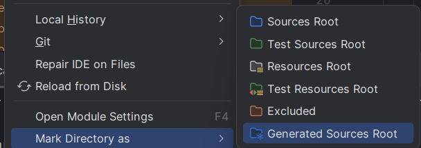

In order to run this project you need to follow theese steps:
1. Clone the repository

2. Open whole smart-home folder in your python IDE
3. Install the requirements for python using `pip install -r requirements.txt`
4. Run proto command from file proto/proto_command.txt (copy paste it to terminal)

5. Open server-java folder in your java IDE
6. Install the requirements for java using `mvn install`
7. Mark these three folders:

as generated sources root:

8. Run GrpcServer.java file 
9. In the python IDE terminal run: uvicorn main:app --reload
10. Go to: http://127.0.0.1:8000 and ENJOY!

